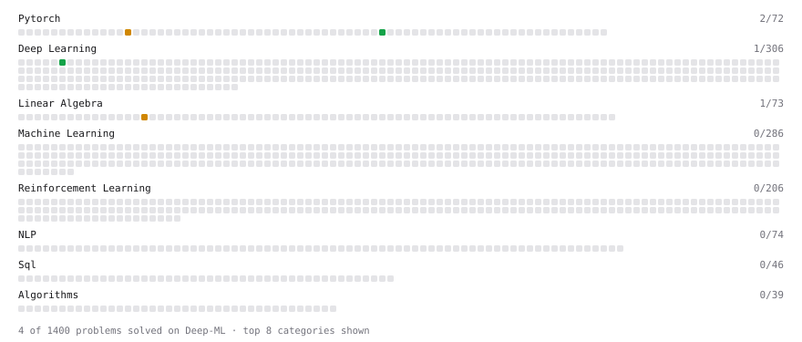

# Deep-ML

My machine learning practice from [Deep-ML](https://www.deep-ml.com). Every solution here was written by hand.

**7** solved · 7 problems · 0 labs · 0 math

[**Browse the interactive portfolio**](https://alvaro-serero.github.io/deep-ml/) to replay this filling in over time.

## Problems

| | Difficulty | Solved | |
| --- | --- | --- | --- |
| [Conv2d Output Shape](https://www.deep-ml.com/problems/1232) | easy | 2026-09-16 | [solution](problems/1232-conv2d-output-shape) |
| [Create and Inspect a Tensor](https://www.deep-ml.com/problems/1220) | easy | 2026-09-16 | [solution](problems/1220-create-and-inspect-a-tensor) |
| [Gradient of a Square with Autograd](https://www.deep-ml.com/problems/1222) | easy | 2026-09-16 | [solution](problems/1222-gradient-of-a-square-with-autograd) |
| [Implementation of Log Softmax Function](https://www.deep-ml.com/problems/39) | easy | 2026-09-15 | [solution](problems/0039-implementation-of-log-softmax-function) |
| [Reshape and Transpose a Tensor](https://www.deep-ml.com/problems/1221) | easy | 2026-09-16 | [solution](problems/1221-reshape-and-transpose-a-tensor) |
| [Calculate Correlation Matrix](https://www.deep-ml.com/problems/37) | medium | 2026-09-15 | [solution](problems/0037-calculate-correlation-matrix) |
| [Implement BatchNorm2d from Scratch (training mode)](https://www.deep-ml.com/problems/902) | medium | 2026-09-16 | [solution](problems/0902-implement-batchnorm2d-from-scratch-training-mode) |

---

_This file is regenerated by Deep-ML on every push._
